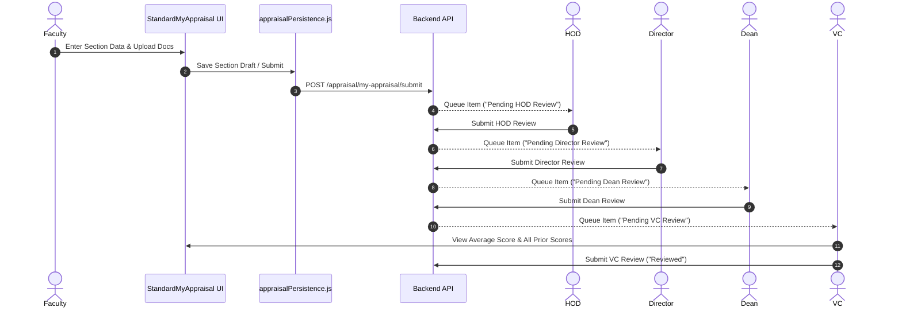

# Universal Technical Documentation: Faculty Appraisal System Frontend (Appraisal Form 2.0)

---

## Table of Contents
1. [Project Overview](#1-project-overview)
2. [Folder Structure](#2-folder-structure)
3. [File-by-File Documentation](#3-file-by-file-documentation)
4. [Component Documentation](#4-component-documentation)
5. [Routing Documentation](#5-routing-documentation)
6. [Authentication Flow](#6-authentication-flow)
7. [Workflow Documentation](#7-workflow-documentation)
8. [Transparency Rules](#8-transparency-rules)
9. [Form Documentation](#9-form-documentation)
10. [Dynamic Tables](#10-dynamic-tables)
11. [API Documentation](#11-api-documentation)
12. [Service Layer](#12-service-layer)
13. [State Management](#13-state-management)
14. [Database Interaction (Frontend Perspective)](#14-database-interaction-frontend-perspective)
15. [File Upload System](#15-file-upload-system)
16. [Review System](#16-review-system)
17. [Dashboard Documentation](#17-dashboard-documentation)
18. [Utility Functions](#18-utility-functions)
19. [Hooks & Custom State Handlers](#19-hooks--custom-state-handlers)
20. [Configuration Files](#20-configuration-files)
21. [Error Handling](#21-error-handling)
22. [Complete Data Flow](#22-complete-data-flow)
23. [Complete Dependency Map](#23-complete-dependency-map)
24. [Future Developer Guide](#24-future-developer-guide)
25. [Known Limitations](#25-known-limitations)
26. [Complete Project Summary](#26-complete-project-summary)
27. [Detailed Feature Implementation Logic & Algorithms](#27-detailed-feature-implementation-logic--algorithms)

---

## 1. Project Overview

### Purpose of the Application
The **Faculty Appraisal System Frontend (Appraisal Form 2.0)** is an enterprise-grade academic and non-teaching staff performance evaluation platform built for **D. Y. Patil International University (DYPIU)**. It digitizes self-appraisals, annual confidential reports (ACR), research output tracking, administrative contribution evaluations, and multi-tier institutional approval workflows.

### Business Objective
- Streamline annual appraisal submissions across 10 academic schools/centers and non-teaching departments.
- Enforce strict hierarchical review chains (Faculty → HOD → Director → Dean → Vice Chancellor).
- Ensure strict score transparency and access control rules (e.g., intermediate reviewers see only applicant self-scores, while the Vice Chancellor views complete score breakdowns).
- Provide real-time auto-calculation of Part A (Teaching Process), Part B (Research & Creative Output), Part C (Administrative Responsibilities), and Part D (ACR) metrics.
- Support persistent section-level draft saving and attachment document management.

### System Overview
- **Core Stack**: React 19, JavaScript (ES Module standard), Vite 8 (build tool & dev server), React Router DOM 7.
- **Styling**: Vanilla CSS modular architecture with custom design tokens, rich HSL palettes, smooth micro-animations, glassmorphic cards, and zero external UI frameworks (No Tailwind).
- **Architecture**: Feature-sliced SPA with dynamic route code-splitting (`React.lazy` + `Suspense`), resilient fallback layers for offline or backend-unreachable modes, and robust local/session storage session synchronization.

### User Roles
1. **Faculty**: Teaches courses, submits self-appraisal form (Part A, B, C, D).
2. **HOD (Head of Department)**: Evaluates department faculty (SoEMR specific).
3. **Director**: Reviews faculty and HOD appraisals for their respective school.
4. **Dean of Engineering**: Reviews Engineering track appraisals (SoCSEA, SoBB, SoCE, SoEMR).
5. **Dean of Non-Engineering**: Reviews Non-Engineering track appraisals (SoC, SoMCS, SoD, SoAA, SoHSS).
6. **Center Head (CISR)**: Evaluates CISR faculty self-appraisals.
7. **Reporting Officer (RO)**: Evaluates non-teaching staff performance.
8. **Registrar**: Reviews Reporting Officer and Non-Teaching Staff appraisals.
9. **Vice Chancellor (VC)**: Final approving authority; views all chain scores and enters final VC evaluation score.

---

## 2. Folder Structure

```
Appraisal-form-2.0/
├── .dockerignore
├── .env
├── .env.example
├── .firebaserc
├── .gitignore
├── @docs/
├── docs/
│   ├── api-integration-guide.md
│   ├── integration.md
│   ├── non-teaching-dynamic-workflow.md
│   ├── sohss-school-addition.md
│   └── Universal_Documentation.md
├── Dockerfile
├── README.md
├── cloudbuild.yaml
├── eslint.config.js
├── firebase.json
├── index.html
├── netlify.toml
├── nginx.conf
├── package.json
├── package-lock.json
├── public/
├── schema.sql
├── scripts/
│   └── verifyHierarchy.mjs
└── src/
    ├── App.css
    ├── App.jsx
    ├── index.css
    ├── main.jsx
    ├── assets/
    ├── auth/
    │   ├── ProtectedRoute.jsx
    │   └── session.js
    ├── components/
    │   ├── AppraisalHeaderImage.jsx
    │   ├── ErrorBoundary.jsx
    │   ├── Inputs.jsx
    │   ├── RejectionNotice.jsx
    │   ├── SummaryOtherInfoField.jsx
    │   ├── SummaryOtherInfoFieldUtils.js
    │   ├── appraisal/
    │   │   ├── MyAppraisalForm.jsx
    │   │   ├── PartA/
    │   │   ├── PartB/
    │   │   ├── PartC/
    │   │   └── common/
    │   │       └── FacultyInfoSection.jsx
    │   └── dashboard/
    │       ├── DashboardLayout.jsx
    │       ├── DashboardSidebar.jsx
    │       └── dashboardPrimitives.jsx
    ├── constants/
    │   ├── formConfig.js
    │   ├── formRouting.js
    │   ├── nonTeachingHierarchy.js
    │   └── universityHierarchy.js
    ├── data/
    │   └── mockData.js
    ├── features/
    │   ├── faculty-appraisal/
    │   │   ├── shared.js
    │   │   ├── index.js
    │   │   └── forms/
    │   │       ├── standard/
    │   │       │   ├── StandardMyAppraisal.jsx
    │   │       │   ├── MyAppraisalSection.jsx
    │   │       │   ├── StandardReport.jsx
    │   │       │   └── index.js
    │   │       └── CreativeSchool/
    │   │           ├── CreativeSchoolAppraisalForm.jsx
    │   │           ├── arrayKeys.js
    │   │           └── index.js
    │   └── previousYearReport/
    │       ├── PreviousYearReportViewer.jsx
    │       └── index.js
    ├── pages/
    │   ├── Login.jsx
    │   ├── Signup.jsx
    │   ├── ResetPassword.jsx
    │   ├── FacultyProfile.jsx
    │   ├── EditProfile.jsx
    │   ├── RoleDashboard.jsx
    │   ├── Dashboard.jsx
    │   ├── HODDashboard.jsx
    │   ├── DirectorDashboard.jsx
    │   ├── DeanDashboard.jsx
    │   ├── NonEngineeringDeanDashboard.jsx
    │   ├── VCDashboard.jsx
    │   ├── DesignArtsDashboard.jsx
    │   ├── MediaCommDashboard.jsx
    │   ├── CISRFacultyDashboard.jsx
    │   ├── CISRCenterHeadDashboard.jsx
    │   ├── NonTeachingStaffDashboard.jsx
    │   ├── ReportingOfficerDashboard.jsx
    │   └── RegistrarDashboard.jsx
    ├── services/
    │   ├── api.js
    │   ├── appraisalPersistence.js
    │   ├── appraisalWindowService.js
    │   ├── authService.js
    │   ├── nonTeachingWorkflow.js
    │   └── reviewWorkflow.js
    └── utils/
        ├── appraisalFormUtils.js
        ├── errorUtils.js
        ├── fullFormReport.js
        ├── hierarchy.js
        ├── legacyDashboardMetrics.js
        ├── permissions.js
        ├── reviewSummaryTotals.js
        ├── schoolConfig.js
        ├── validation.js
        └── workflow.js
```

---

## 3. File-by-File Documentation

### Core Entry Files

#### `src/main.jsx`
- **Location**: `src/main.jsx`
- **Purpose**: Application DOM root rendering and React tree mounting.
- **Responsibilities**: Mounts `<App />` inside `<React.StrictMode>` into `#root`.
- **Imports**: `React`, `ReactDOM`, `./App.jsx`, `./index.css`.
- **Used by**: `index.html`.

#### `src/App.jsx`
- **Location**: `src/App.jsx`
- **Purpose**: Top-level routing container, global input wheel/arrow key prevention, and session academic cycle refresh.
- **Responsibilities**: Wraps routes with `BrowserRouter`, `ErrorBoundary`, and `Suspense`. Loads user profile asynchronously in `<ProfileLoader />`.
- **Imports**: `react-router-dom`, `ProtectedRoute`, `ErrorBoundary`, `authService`, `session`.
- **Key Functions**:
  - `normalizeAcademicYearCycles(cyclesData)`: Standardizes academic year strings (e.g. `24-25` to `2024-2025`).
  - `ProfileLoader`: Fetches logged-in user details via `getMe()` and renders `FacultyProfile`.

---

### Authentication Module (`src/auth/`)

#### `src/auth/session.js`
- **Location**: `src/auth/session.js`
- **Purpose**: Manages auth tokens, user roles, active academic year, and session storage persistence.
- **Key Functions**: `getToken()`, `setToken()`, `storeUserSession()`, `clearUserSession()`, `getActiveAcademicYear()`, `setActiveAcademicYear()`, `normalizeRole()`.

#### `src/auth/ProtectedRoute.jsx`
- **Location**: `src/auth/ProtectedRoute.jsx`
- **Purpose**: Guard component that redirects unauthenticated users to `/login`.

---

### Pages (`src/pages/`)

#### `src/pages/Login.jsx`
- **Location**: `src/pages/Login.jsx`
- **Purpose**: User login screen. Handles credentials input, role selection, JWT token receipt, and redirection to `/profile` or `/dashboard`.

#### `src/pages/Signup.jsx`
- **Location**: `src/pages/Signup.jsx`
- **Purpose**: User registration screen. Captures Employee ID, Full Name, School selection (10 options), Department, Designation, and Role.

#### `src/pages/RoleDashboard.jsx`
- **Location**: `src/pages/RoleDashboard.jsx`
- **Purpose**: Central routing switch dispatching the user to their specific dashboard based on role and school form type.

#### `src/pages/VCDashboard.jsx`
- **Location**: `src/pages/VCDashboard.jsx`
- **Purpose**: Vice Chancellor review dashboard. Computes Average Scores across prior stages, displays all prior reviewer remarks, and submits VC final evaluation.

#### `src/pages/DeanDashboard.jsx` & `NonEngineeringDeanDashboard.jsx`
- **Location**: `src/pages/DeanDashboard.jsx`, `src/pages/NonEngineeringDeanDashboard.jsx`
- **Purpose**: Engineering and Non-Engineering Dean approval portals. Manages approval queues for Directors, HODs, and Faculty.

#### `src/pages/DirectorDashboard.jsx`
- **Location**: `src/pages/DirectorDashboard.jsx`
- **Purpose**: School Director portal. Manages faculty approval queues and self-appraisal submissions.

---

### Features & Form Modules (`src/features/`)

#### `src/features/faculty-appraisal/forms/standard/StandardMyAppraisal.jsx`
- **Location**: `src/features/faculty-appraisal/forms/standard/StandardMyAppraisal.jsx`
- **Purpose**: Standard Engineering appraisal self-evaluation form (Parts A, B, C, D) with dynamic row additions, document upload cells, auto-calculations, and draft persistence.

#### `src/features/faculty-appraisal/forms/CreativeSchool/CreativeSchoolAppraisalForm.jsx`
- **Location**: `src/features/faculty-appraisal/forms/CreativeSchool/CreativeSchoolAppraisalForm.jsx`
- **Purpose**: Comprehensive appraisal form and review panel for Creative & Non-Engineering schools (SoMCS, SoHSS, SoD, SoAA).

---

### Services (`src/services/`)

#### `src/services/api.js`
- **Location**: `src/services/api.js`
- **Purpose**: Central Axios client configuration with bearer token interceptor and API route wrappers.

#### `src/services/appraisalPersistence.js`
- **Location**: `src/services/appraisalPersistence.js`
- **Purpose**: Standard self-appraisal persistence service for loading/saving section drafts, submitting appraisals, and attaching documents.

#### `src/services/reviewWorkflow.js`
- **Location**: `src/services/reviewWorkflow.js`
- **Purpose**: Authority review service for fetching reviewer queues, saving reviewer score drafts, and submitting final reviews (HOD, Director, Dean, VC).

#### `src/services/nonTeachingWorkflow.js`
- **Location**: `src/services/nonTeachingWorkflow.js`
- **Purpose**: Non-teaching staff appraisal persistence and review workflow service (Reporting Officer, Registrar, VC).

---

### Utilities (`src/utils/`)

#### `src/utils/hierarchy.js`
- **Location**: `src/utils/hierarchy.js`
- **Purpose**: Core institutional hierarchy routing logic, review chain generator, role normalizers, and score transparency visibility guards.

#### `src/utils/reviewSummaryTotals.js`
- **Location**: `src/utils/reviewSummaryTotals.js`
- **Purpose**: Helper functions for parsing review score payloads, extracting nested scores, and aggregating standard submitted score summaries.

#### `src/utils/validation.js`
- **Location**: `src/utils/validation.js`
- **Purpose**: Input validation helpers (email format, password strength, required field checks).

---

## 4. Component Documentation

### `DashboardLayout` (`src/components/dashboard/DashboardLayout.jsx`)
- **Props**: `children`, `sidebar`, `appInfo`, `showLogoutModal`, `onCancelLogout`, `containerStyle`, `mainStyle`.
- **Purpose**: Top-level page container providing a responsive sidebar navigation slot, main content area, and modal overlay portal.

### `DashboardSidebar` (`src/components/dashboard/DashboardSidebar.jsx`)
- **Props**: `navItems`, `activeTab`, `onTabSelect`, `profileSubtitle`, `onLogout`, `showSectionSelector`, `sectionTab`, `onSectionChange`.
- **Purpose**: Sidebar navigation drawer displaying school branding, user badge, main tabs, and contextual section selectors for Part A, B, C, D.

### `CreativeSchoolAuthorityReviewPanel` (`src/features/faculty-appraisal/.../CreativeSchoolAppraisalForm.jsx`)
- **Props**: `person`, `reviewerRole`, `onBack`, `onSubmit`, `readOnly`, `showReport`.
- **Purpose**: Unified review interface for evaluating Creative School appraisals (SoMCS, SoHSS, SoD, SoAA). Supports all authority roles (`director`, `dean`, `vc`).

---

## 5. Routing Documentation

The routing is powered by `react-router-dom` in `src/App.jsx` and `src/pages/RoleDashboard.jsx`:

```
/login              -> Login page
/signup             -> Signup page
/reset-password     -> Reset Password page
/profile            -> Profile Loader -> FacultyProfile
/edit-profile       -> EditProfile page
/dashboard          -> ProtectedRoute -> RoleDashboard
```

### Role-Based Routing Matrix in `RoleDashboard.jsx`

```javascript
switch (role) {
  case "faculty":
    if (isCisrSchool(school)) return <CISRFacultyDashboard />;
    if (formType === FORM_TYPES.MEDIA_COMM) return <MediaCommDashboard />;
    if (formType === FORM_TYPES.DESIGN_ARTS) return <DesignArtsDashboard />;
    return <Dashboard />;

  case "center_head":
    return <CISRCenterHeadDashboard />;

  case "hod":
    return departmentHasHod(school, department) ? <HODDashboard /> : <DirectorDashboard />;

  case "director":
    if (formType === FORM_TYPES.MEDIA_COMM) return <MediaCommDashboard fixedRole="director" />;
    if (formType === FORM_TYPES.DESIGN_ARTS) return <DesignArtsDashboard fixedRole="director" />;
    return <DirectorDashboard />;

  case "dean":
    if (formType === FORM_TYPES.MEDIA_COMM) return <MediaCommDashboard fixedRole="dean" />;
    if (formType === FORM_TYPES.DESIGN_ARTS) return <DesignArtsDashboard fixedRole="dean" />;
    return getDeanTrack(profile) === DEAN_TRACKS.NON_ENGINEERING 
      ? <NonEngineeringDeanDashboard /> 
      : <DeanDashboard />;

  case "vc":
    return <VCDashboard />;

  case "registrar":
    return <RegistrarDashboard />;

  case "reporting_officer":
    return <ReportingOfficerDashboard />;

  case "non_teaching_staff":
    return <NonTeachingStaffDashboard />;
}
```

---

## 6. Authentication Flow

1. **User Login**: User submits email/username & password via `Login.jsx` $\rightarrow$ calls `login(credentials)` in `authService.js`.
2. **Session Storage**: Access token and refresh token are stored via `storeUserSession()`. User profile data is stored in `sessionStorage` and `localStorage`.
3. **API Interceptor**: `api.js` attaches `Authorization: Bearer <token>` to every HTTP request automatically.
4. **Route Protection**: `<ProtectedRoute>` checks for token existence. If missing, redirects to `/login`.
5. **Academic Cycle Sync**: On app load, `App.jsx` calls `/appraisal/cycles` to load available academic years and dispatches a custom event `academicYearChanged`.

---

## 7. Workflow Documentation

### 1. Engineering Track (SoEMR - with HOD)
$$\text{Faculty} \longrightarrow \text{HOD} \longrightarrow \text{Director (SoEMR)} \longrightarrow \text{Dean of Engineering} \longrightarrow \text{Vice Chancellor}$$

### 2. Engineering Track (SoCSEA, SoBB, SoCE - without HOD)
$$\text{Faculty} \longrightarrow \text{Director (School Matched)} \longrightarrow \text{Dean of Engineering} \longrightarrow \text{Vice Chancellor}$$

### 3. Non-Engineering Track (SoC, SoMCS, SoD, SoAA, SoHSS)
$$\text{Faculty} \longrightarrow \text{Director (School Matched)} \longrightarrow \text{Dean of Non-Engineering} \longrightarrow \text{Vice Chancellor}$$

### 4. Center for Interdisciplinary Studies and Research (CISR)
$$\text{Faculty} \longrightarrow \text{Center Head (CISR)} \longrightarrow \text{Vice Chancellor}$$

### 5. Non-Teaching Staff Track
$$\text{Staff} \longrightarrow \text{Reporting Officer} \longrightarrow \text{Registrar} \longrightarrow \text{Vice Chancellor}$$

---

## 8. Transparency Rules

To preserve evaluation objectivity across intermediate review levels, strict transparency rules are enforced in `src/utils/hierarchy.js`:

1. **HOD Reviewer**: Sees only Faculty self-score.
2. **Director Reviewer**: Sees only applicant self-score (HOD score is masked/hidden).
3. **Dean Reviewer**: Sees only applicant self-score (HOD and Director scores are masked/hidden).
4. **Registrar Reviewer**: Sees only Staff self-score (Reporting Officer score is masked/hidden).
5. **Vice Chancellor (VC)**: Sees the complete score chain (Self Score + HOD Score + Director Score + Dean Score).
6. **VC Dashboard Average Score**: Computes the mean of available submitted scores prior to the VC stage:
$$\text{Average Score} = \frac{\text{Self Score} + \sum \text{Prior Reviewer Scores}}{\text{Count of Submitted Scores}}$$
The average score is formatted to 1 decimal place (`.toFixed(1)`).

---

## 9. Form Documentation

### Section Structure & Max Marks

| Section | Title / Content | Max Score |
| :--- | :--- | :--- |
| **Part A** | Teaching Process, Course File, Innovative Teaching, Student Feedback, OBE Practice, Mentoring, Quals | 150 |
| **Part B** | Research Papers, Books, Patents, Grants, Guidance, Consultancy, Conferences, FDPs, Awards, ICT | 350 |
| **Part C** | Administration (University & School level), Events, Outreach, Industry Linkages, Alumni, Placements | 150 |
| **Part D** | Annual Confidential Report (ACR) | 50 |
| **Total** | **Grand Total** | **700** |

---

## 10. Dynamic Tables

Dynamic tables in `StandardMyAppraisal.jsx` and `CreativeSchoolAppraisalForm.jsx` handle variable-length item collections (e.g. publication list, lectures conducted).

### Row Operations Workflow
1. **Row Creation**: User clicks "Add Row". State updater appends an empty row schema object to the array key (e.g., `form.journals`).
2. **Row Editing**: Input change triggers row state update by index:
```javascript
const updateRow = (arrayKey, index, field, value) => {
  setForm(prev => {
    const list = [...(prev[arrayKey] || [])];
    list[index] = { ...list[index], [field]: value };
    return { ...prev, [arrayKey]: list };
  });
};
```
3. **Row Removal**: User clicks delete icon $\rightarrow$ row is spliced out by index.
4. **Attachment Linking**: Each row includes a `doc` field referencing an uploaded document key in `form.docs`.

---

## 11. API Documentation

| Endpoint | Method | Purpose | Caller |
| :--- | :--- | :--- | :--- |
| `/auth/login` | `POST` | Authenticates user & returns JWT | `authService.js` |
| `/auth/me` | `GET` | Fetches current user profile | `authService.js` |
| `/appraisal/cycles` | `GET` | Fetches academic year cycles | `App.jsx` |
| `/appraisal/my-appraisal` | `GET` | Loads saved self-appraisal draft | `appraisalPersistence.js` |
| `/appraisal/my-appraisal/section` | `POST` | Saves section draft (Part A/B/C/D) | `appraisalPersistence.js` |
| `/appraisal/my-appraisal/submit` | `POST` | Submits complete self-appraisal | `appraisalPersistence.js` |
| `/appraisal/review-queue` | `GET` | Fetches review queue for reviewer role | `reviewWorkflow.js` |
| `/appraisal/review` | `POST` | Submits workflow review score & remarks | `reviewWorkflow.js` |
| `/appraisal/upload-doc` | `POST` | Uploads evidence document file | `appraisalPersistence.js` |

---

## 12. Service Layer

### `api.js`
Axios wrapper handling base URL configuration, Bearer token insertion, and centralized error logging.

### `appraisalPersistence.js`
Handles self-appraisal persistence, section draft auto-saving, document attachment uploads, and offline fallback mock data merging.

### `reviewWorkflow.js`
Manages authority reviewer operations (loading review queues, fetching applicant form payloads, saving reviewer score drafts, submitting final decisions).

---

## 13. State Management

- **Local Form State**: `form` object in `StandardMyAppraisal` and `CreativeSchoolAppraisalForm` managing section inputs, dynamic table arrays, ACR parameters, and document keys.
- **Section Save Tracking**: `sectionSaveStatus` object tracking saved state (`partA: true`, `partB: false`, etc.).
- **Global Auth & Cycle State**: Synchronized via `sessionStorage`, `localStorage`, and custom window event `academicYearChanged`.

---

## 14. Database Interaction (Frontend Perspective)

The frontend serializes form state into a structured JSON payload:

```json
{
  "academic_year": "2026-2027",
  "info": {
    "name": "Dr. Smith",
    "employeeId": "EMP102",
    "school": "SoCSEA",
    "designation": "Associate Professor"
  },
  "totals": {
    "partA": 135.5,
    "partB": 280.0,
    "partC": 120.0,
    "partD": 45.0,
    "grandTotal": 580.5
  },
  "payload": {
    "lectures": [...],
    "journals": [...],
    "uniActs": [...],
    "acr": [...],
    "docs": { "lec_0": "https://..." }
  }
}
```

---

## 15. File Upload System

1. **File Selection**: User selects PDF/Image attachment in a dynamic table cell.
2. **Validation**: Verified against allowed MIME types and max size (5MB).
3. **Upload Request**: Sent via `uploadAppraisalDocument()` in `appraisalPersistence.js`.
4. **URL Mapping**: Backend returns file URL, mapped to `form.docs[docKey]`.
5. **View Document Cell**: Rendered via `<ViewDocsCell>` or `<DocCell>` providing clickable preview links.

---

## 16. Review System

1. Reviewer opens pending item from approval queue.
2. `reviewWorkflow.js` fetches applicant form payload.
3. Reviewer enters section scores in designated authority input fields (`hod`, `director`, `dean`, `vc`).
4. Scores are clamped against maximum allowed limits via `clampReviewScore()`.
5. Reviewer submits review $\rightarrow$ status updates to `${Role} Reviewed` and moves to the next role in the review chain.

---

## 17. Dashboard Documentation

### `Dashboard.jsx` (Faculty)
Self-appraisal entry portal showing overall progress, section cards, declaration checkbox, and PDF report generator.

### `HODDashboard.jsx` & `DirectorDashboard.jsx`
Displays review queue for department/school faculty, status badges, and review modal forms.

### `DeanDashboard.jsx` & `NonEngineeringDeanDashboard.jsx`
Manages track-level approval queues for Engineering and Non-Engineering schools respectively.

### `VCDashboard.jsx`
University-wide executive portal displaying Average Scores, complete prior score breakdowns, and final VC score entry.

---

## 18. Utility Functions

### `hierarchy.js`
- `getReviewChain(profile)`: Computes exact sequence of reviewer roles for a user.
- `visiblePreviousReviewRoles(reviewerRole, subjectProfile)`: Enforces score masking for intermediate reviewers.

### `reviewSummaryTotals.js`
- `standardSubmittedScoreSummary(subject)`: Computes normalized Part A, B, C, D totals and maximum caps.

---

## 19. Hooks & Custom State Handlers

- `useEffect` hooks in dashboards handle academic cycle listeners, appraisal window lock checks, and queue auto-refresh.
- Custom state handlers (`handleSelfSectionChange`, `handleReviewAcademicYearChange`) preserve window scroll positions across tab switches.

---

## 20. Configuration Files

- `package.json`: Project scripts (`dev`, `build`, `lint`, `verify:hierarchy`), React 19, Vite 8, Axios.
- `vite.config.js`: Vite build configuration and plugin setup.
- `eslint.config.js`: ESLint code formatting rules.
- `scripts/verifyHierarchy.mjs`: Automated Node test script validating hierarchy mappings and visibility rules.

---

## 21. Error Handling

- **Boundary**: React `<ErrorBoundary>` catches uncaught rendering exceptions and displays a graceful fallback screen.
- **Form Validation**: `validateDesignArtsBeforeSubmit()` and `validateCompleteRows()` enforce complete inputs before submission.
- **API Errors**: `errorUtils.js` formats network and server errors into user-friendly alerts.

---

## 22. Complete Data Flow



---

## 23. Complete Dependency Map

```
RoleDashboard.jsx
 ├── auth/session.js
 ├── constants/universityHierarchy.js
 ├── constants/formRouting.js
 ├── utils/hierarchy.js
 ├── pages/
 │    ├── Dashboard.jsx
 │    ├── DesignArtsDashboard.jsx
 │    ├── MediaCommDashboard.jsx
 │    ├── HODDashboard.jsx
 │    ├── DirectorDashboard.jsx
 │    ├── DeanDashboard.jsx
 │    ├── NonEngineeringDeanDashboard.jsx
 │    ├── VCDashboard.jsx
 │    └── NonTeachingStaffDashboard.jsx
 └── features/faculty-appraisal
      ├── forms/standard/
      └── forms/CreativeSchool/
```

---

## 24. Future Developer Guide

### Adding a New School
1. Add school entry object to `UNIVERSITY_SCHOOLS` in `src/constants/universityHierarchy.js`.
2. Specify `deanTrack` (`DEAN_TRACKS.ENGINEERING` or `NON_ENGINEERING`).
3. Assign form type mapping in `FORM_SCHOOL_CODES` in `src/constants/formRouting.js`.
4. Run automated test suite: `node scripts/verifyHierarchy.mjs`.

### Adding a New Role
1. Add role key to `normalizeRoleForWorkflow()` in `src/utils/hierarchy.js`.
2. Update `getReviewChain()` to specify the new role's position in the approval chain.
3. Add role dashboard switch case in `src/pages/RoleDashboard.jsx`.

---

## 25. Known Limitations

- **Browser Storage Dependency**: Offline draft caches rely on `localStorage` / `sessionStorage`. Clearing browser data clears unsaved offline drafts.
- **Attachment File Size**: File upload ceiling is 5MB per document.

---

## 26. Complete Project Summary

The Faculty Appraisal System Frontend Application (Appraisal Form 2.0) is a robust, modular, role-governed single-page application. From initial login to final Vice Chancellor sign-off, data flows seamlessly through structured state objects, validated services, and role-restricted views. The codebase guarantees score privacy for intermediate reviewers while providing complete visibility and analytics to top institutional executives, fulfilling all requirements of the university appraisal process.

---

## 27. Detailed Feature Implementation Logic & Algorithms

This section provides the exact technical implementation logic and step-by-step algorithms behind every key feature in the application.

### 27.1. Dynamic Review Chain Engine (`src/utils/hierarchy.js`)
The approval routing engine determines the exact sequence of reviewer roles an appraisal must navigate based on user role, school, department, and non-teaching flags.

#### Algorithmic Logic (`getReviewChain(profile)`):
```javascript
export const getReviewChain = (profile = {}) => {
  const role = normalizeRoleForWorkflow(profile.appraisal_role || profile.role);
  const reportsToRegistrar = profile.reports_to_registrar === true || String(profile.reports_to_registrar).toLowerCase() === "true";

  if (role === "vc") return [];
  if (role === "registrar") return ["vc"];
  if (role === "reporting_officer") return ["registrar", "vc"];
  if (role === "non_teaching_staff") return reportsToRegistrar ? ["registrar", "vc"] : ["reporting_officer", "registrar", "vc"];
  if (role === "center_head") return ["vc"];
  if (role === "dean") return ["vc"];
  if (role === "director") return ["dean", "vc"];
  if (role === "hod") return ["director", "dean", "vc"];

  if (getSchoolKey(profile.school) === "CISR") return ["center_head", "vc"];
  if (getSchoolKey(profile.school) === "SoEMR") return ["hod", "director", "dean", "vc"];

  return departmentHasHod(profile.school, profile.department)
    ? ["hod", "director", "dean", "vc"]
    : ["director", "dean", "vc"];
};
```

#### Authority Eligibility Logic (`canAuthorityReviewProfile`):
1. **VC**: Can review any role except another VC (`subjectRole !== "vc"`).
2. **Registrar**: Can review `non_teaching_staff` and `reporting_officer`.
3. **Reporting Officer**: Can review `non_teaching_staff` unless `reports_to_registrar` is true.
4. **Dean**: Matches `deanTrack` (`engineering` vs `non_engineering`) against `subjectProfile`. Cannot review another Dean or `DIRECT_VC` (CISR).
5. **Director**: Matches exact school key (`getSchoolKey(reviewer.school) === getSchoolKey(subject.school)`). Can review `faculty` or `hod`.
6. **HOD**: Matches school key (`SoEMR`), department (`canonicalDepartmentValue(reviewer.department) === canonicalDepartmentValue(subject.department)`), and subject role (`faculty`).

---

### 27.2. Score Transparency & Masking Engine (`src/utils/hierarchy.js` & `VCDashboard.jsx`)
To ensure un-biased appraisals, intermediate authorities (HOD, Director, Dean, Registrar) must not see scores awarded by earlier reviewers in the chain. Only the Vice Chancellor views the complete breakdown.

#### Visibility Guard Logic (`visiblePreviousReviewRoles`):
```javascript
export const visiblePreviousReviewRoles = (reviewerRole, subjectProfile = {}) => {
  const role = normalizeRoleForWorkflow(reviewerRole);
  if (role === "admin") return getSchoolKey(subjectProfile.school) === "CISR" ? ["center_head"] : ["hod", "director", "dean"];
  if (role !== "vc") return []; // Returns empty array for all non-VC reviewers!

  const chain = getReviewChain(subjectProfile);
  const reviewerIndex = chain.indexOf(role);
  if (reviewerIndex < 0) return [];
  return chain.slice(0, reviewerIndex); // Returns prior chain roles for VC
};
```

#### VC Average Score Calculation Algorithm (`VCDashboard.jsx`):
In `VCDashboard.jsx`, prior reviewer scores and the faculty self-score are combined to compute the Average Score displayed before VC evaluation:
```javascript
const vcAverageBeforeVc = (person = {}, personMode = "faculty", previousRoles = vcPreviousRolesFor(person, personMode)) => {
  const scores = [
    rawVcSelfTotalForPerson(person),
    ...previousRoles
      .filter((role) => role !== personMode)
      .map((role) => rawVcTotalForRole(person, role)),
  ]
  .filter(hasScoreValue)
  .map(Number);

  if (!scores.length) return 0;
  const avg = scores.reduce((sum, value) => sum + value, 0) / scores.length;
  return Math.trunc(avg * 10) / 10; // Truncated to 1 decimal place (.toFixed(1))
};
```

---

### 27.3. Dynamic Form Capping & Real-Time Auto-Calculation (`src/utils/appraisalFormUtils.js`)
Real-time calculation logic ensures row inputs automatically update Part A, B, C, and D totals while enforcing hard institutional caps.

#### Score Capping Math:
```javascript
export const clampScore = (val, max) => {
  const num = parseFloat(val);
  if (isNaN(num)) return 0;
  if (num < 0) return 0;
  return Math.min(num, max);
};
```

#### Section Capping Rules:
- **Part A Total**: $\min(\text{Lectures} + \text{Course File} + \text{Innovative Teaching} + \text{Feedback} + \text{OBE} + \text{Projects} + \text{Mentoring} + \text{Quals}, 150)$
- **Part B Total**: $\min(\text{Journals} + \text{Books} + \text{Patents} + \text{Grants} + \text{Guidance} + \text{Consultancy} + \text{Confs} + \text{FDPs} + \text{Awards} + \text{ICT}, 350)$
- **Part C Total**: $\min(\text{Uni Admin} + \text{Dept Admin} + \text{Events} + \text{Outreach} + \text{Industry} + \text{Alumni} + \text{Placement}, 150)$
- **Part D Total (ACR)**: $\min(\sum \text{ACR Row Scores}, 50)$
- **Grand Total**: $\min(\text{Part A} + \text{Part B} + \text{Part C} + \text{Part D}, 700)$

---

### 27.4. Multi-Section Draft Persistence & Storage Cascade (`src/services/appraisalPersistence.js`)
To prevent data loss, the application implements a multi-tier persistence cascade for self-appraisals and reviewer evaluations.

#### Implementation Logic (`saveAppraisalDraftSection`):
1. **Payload Construction**: Combines current section inputs with existing metadata.
2. **Primary Storage**: Issues `POST /appraisal/my-appraisal/section` request via Axios.
3. **Session Sync**: Saves updated section payload into `sessionStorage.setItem("saved_appraisal_draft", JSON.stringify(payload))`.
4. **LocalStorage Sync**: Saves persistent backup in `localStorage.setItem("appraisal_draft_backup", JSON.stringify(payload))`.
5. **Fallback Merge (`mergeForm`)**: On load (`loadSavedAppraisal`), if API request fails due to offline mode, the system retrieves local storage drafts and merges them cleanly into the empty form schema without overwriting user data.

---

### 27.5. Role Dashboard Switcher & Form Variant Binding (`src/pages/RoleDashboard.jsx`)
Determines which dashboard bundle to load dynamically using `formTypeForSchool(getSchoolKey(school))`.

#### School to Form Type Mapping (`src/constants/formRouting.js`):
- `FORM_TYPES.DEFAULT`: SoCSEA, SoBB, SoCE, SoEMR, CISR $\rightarrow$ Renders `StandardMyAppraisal` / `Dashboard.jsx`.
- `FORM_TYPES.MEDIA_COMM`: SoMCS, SoHSS $\rightarrow$ Renders `MediaCommDashboard.jsx` (Creative Form).
- `FORM_TYPES.DESIGN_ARTS`: SoD, SoAA $\rightarrow$ Renders `DesignArtsDashboard.jsx` (Creative Form).

#### Director & Dean Mapping Logic:
When a Director or Dean from a Creative School (SoAA, SoD, SoMCS, SoHSS) opens *My Appraisal* or *Approvals*, `RoleDashboard.jsx` binds `fixedRole="director"` or `fixedRole="dean"` to `DesignArtsDashboard` or `MediaCommDashboard`. This ensures that Directors and Deans in Creative Schools always use the exact Creative School form structure instead of falling back to the standard engineering form.
